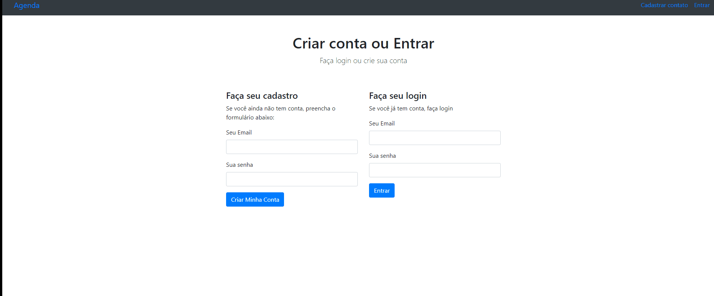

<h1>Agenda</h1>


<p align = "center">
<a href="#sobre">Sobre</a> •
<a href="#tecnologias">Tecnologias</a> •
<a href="#autor">Autor</a>
</p>

# Sobre
<p>Projeto agenda, utilizando Mongodb como banco de dados.</p>

<h2> Cadastro de usuário. </h2>

<p align="center">
  
</p>

(https://github.com/NJesus144/agenda-express-mongodb/blob/main/frontend/assets/img/cadastroBackend.gif)

<h2> Criando, editando e excluindo contato da agenda.</h2>
(https://github.com/NJesus144/agenda-express-mongodb/blob/main/frontend/assets/img/cadastroAgenda.gif)


# Tecnologias

• Javascript
• Nodejs
• Express.js
• Webpack

Pré-requisitos
Antes de começar, você precisa ter instalado em sua máquina as seguintes ferraments [Git](https://git-scm.com), [Node.js](https://node.js.org/en). Além de um editor de texto para trabalhar com o código como o [VSCode](https://code.visualstudio.com/).
Rodando a aplicação

```bash
# Clone este repositório
$ git clone https://github.com/NJesus144/agenda-express-mongodb

# Acesse a pasta do projeto no terminal/cd
$cd agenda-express-mongodb

# Instale as dependências
$ npm install

# Execute a aplicação em modo de desenvolvimento
$ npm start

# Execute a aplicação em modo de desenvolvimento
$ npm run dev [Webpack]

# O servidor iniciará na porta:3000 - acesse <http://localhost:3000>
```

# Autor

<p>Nalbert de Jesus </p>
